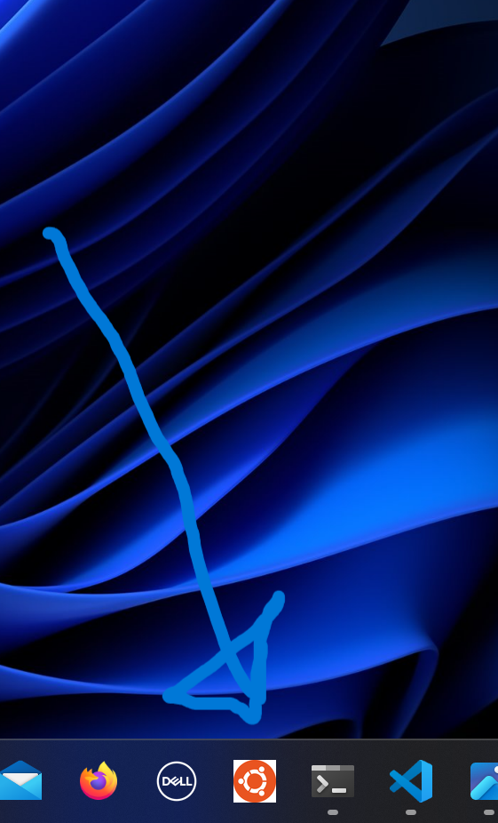

# python-automate-boring

## Overview

Hi, I'm learning Python.  The book, Automate the boring stuff is a really good resource.

If you want to following along, I've included the methods and tools I'm using to complete the exercises in the book.

Get in touch if you have ay queries.

## Tools

`WSL (Ubuntu)`

I have a shortcut on my Windows Desktop, from here I double click and voila it launches Ubuntu Linux.



`visual studio`

I launch Visual Studio from within WSL, as follows:

```
cd ~/python-automate-boring
code .
```

`python3`
```
python3 <filename.py>
```

`git`
```
git status

#switch to the main branch
git checkout main

#create a new branch
git checkout -b my-new-branch

git add <myfile>

git commit -m "my latest changes"

git push
```

`Linux`
```
cd ..

cd <directory-name>

ll -a

pwd

mkdir <my-new-directory>
```

`Windows short-cuts`

```
alt-tab
```
